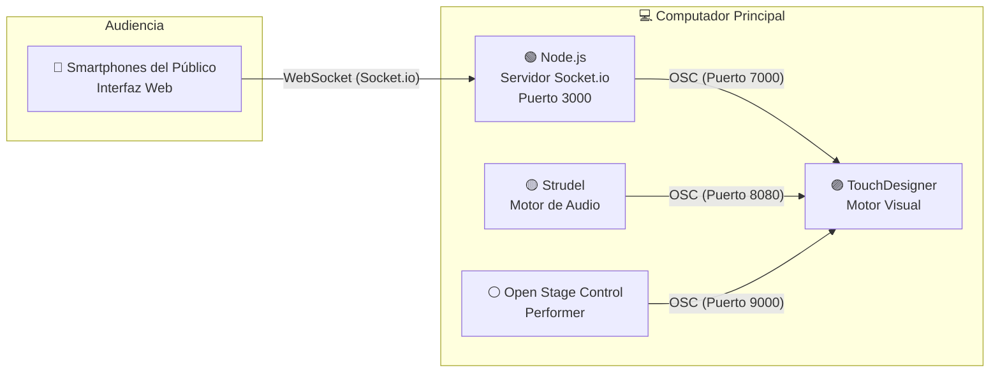

## Bitácoras de aprendizaje 2026-10

### Actividad 01 — Organización de la documentación

**Fecha: 5 de mayo de 2026**

#### 1. Diagrama del sistema

El sistema de la obra *Cosmos* se estructura como un ecosistema interactivo en tiempo real compuesto por cuatro componentes principales: **audio, visuales, performer y público**, conectados mediante protocolos de comunicación que permiten el flujo continuo de datos.



**Descripción del flujo de datos:**

* El **audio generado en Strudel** envía eventos mediante OSC a TouchDesigner, activando cambios visuales en tiempo real.
* El **performer**, a través de Open Stage Control, controla la transición estructural de la obra.
* El **público**, desde sus dispositivos móviles, envía información de color mediante Socket.io hacia un servidor Node.js, que traduce estos datos a OSC para modificar parámetros visuales.

#### 2. Paso a paso para reproducir la obra

**Requisitos previos**

**Hardware:**

* Computador (Mac o Windows)
* Dispositivo móvil (celular)
* Tablet (opcional, para control del performer)

**Software:**

* TouchDesigner
* Node.js
* Navegador web
* Open Stage Control
* Strudel

**Instalación**

1. Clonar el repositorio:

```bash
git clone https://github.com/Valengp2006/Proyecto_Cosmos.git
cd Proyecto_Cosmos
```

2. Instalar dependencias:

```bash
npm install
```

**Ejecución del sistema**

1. Iniciar el servidor:

```bash
node server.js
```

2. Abrir TouchDesigner:

- Cargar el archivo `.toe`
- Verificar recepción OSC en puertos:
  - 8080 (audio)
  - 9000 (performer)
  - 7000 (público)

3. Ejecutar Strudel:

- Iniciar la partitura
- Verificar envío de datos OSC

4. Conectar Open Stage Control:

- Abrir interfaz del performer
- Probar slider y botón reset

5. Conectar público:

- Conectar dispositivos a la misma red
- Acceder a:

```
http://[IP-del-servidor]:3000
```

6. Verificar funcionamiento:

- La luna cambia de color
- Las visuales responden al performer
- Existe sincronización con el audio
- No hay latencia perceptible

#### 3. Explicación detallada

**Concepto artístico**

*Cosmos* es una experiencia audiovisual interactiva que simula la formación de un entorno espacial. La obra se desarrolla de manera progresiva, pasando de un estado de calma a uno de alta intensidad, generando sensaciones de expansión, descubrimiento y asombro.

**Funcionamiento del sistema**

El sistema se organiza en cuatro componentes:

- **Audio (Strudel):** genera la estructura sonora en tiempo real y define la evolución temporal.
-  **Visuales (TouchDesigner):** construyen el entorno visual mediante partículas y reaccionan a inputs externos.
-  **Performer (Open Stage Control):** controla la transición entre estados visuales.
-   **Público (Web + Socket.io):** interviene modificando el color de la luna en tiempo real.

**Justificación técnica**

- **OSC:** permite comunicación eficiente y en tiempo real entre audio y visuales.
- **Socket.io:** facilita la interacción multiusuario desde navegadores.
- **Node.js:** actúa como puente entre web y sistema visual.
- **TouchDesigner:** permite crear visuales complejas y reactivas.
- **Strudel:** permite generar estructuras sonoras dinámicas mediante live coding.

Estas herramientas permiten construir un sistema modular, estable y en tiempo real.

**Justificación estética**

- La obra utiliza una estética espacial basada en nebulosas y cuerpos celestes.
- La paleta de colores (morado, rosado, naranja) está inspirada en imágenes astronómicas.
- El uso de partículas permite representar procesos de formación y movimiento.
- La luna funciona como elemento central y punto de conexión con el público.

**Relación concepto–técnica**

El sistema distribuye el control de la experiencia:

- El **audio** define el tiempo
- El **performer** define la estructura
- El **público** introduce variación

Esto convierte la obra en un sistema dinámico donde múltiples agentes influyen en un mismo entorno.

### Actividad 02 — Escritura de la documentación

**Fecha: 5 de mayo de 2026**

#### 1. Construcción de la documentación

Para esta actividad se organizó la documentación del proyecto en tres secciones principales: diagrama del sistema, instrucciones de reproducción y explicación detallada. El objetivo fue transformar el proceso de desarrollo en una guía clara que permita a otros comprender y ejecutar la obra.

#### 2. Decisiones en la organización

Se optó por estructurar la documentación de la siguiente manera:

- Primero, una **visión general del sistema** mediante un diagrama que permite entender rápidamente las conexiones.
-  Luego, una **guía paso a paso**, enfocada en la reproducibilidad.
-  Finalmente, una **explicación conceptual y técnica**, que conecta el funcionamiento con la intención artística.

Esta organización facilita distintos niveles de lectura: técnico, práctico y conceptual.

#### 3. Reflexión sobre el proceso

El ejercicio de documentar permitió evidenciar que el proyecto no es únicamente una pieza visual o sonora, sino un sistema interactivo compuesto por múltiples capas interconectadas.

Además, ayudó a clarificar:

- La relación entre los distintos componentes
- El flujo de información dentro del sistema
- La intención detrás de cada decisión técnica

También se identificó la importancia de traducir procesos complejos en explicaciones claras, especialmente cuando se busca que otros puedan reproducir la obra.

#### 4. Aprendizajes

- Documentar no es solo describir, sino **estructurar el conocimiento del proyecto**.
- Un buen diagrama puede comunicar más rápido que una explicación extensa.
- La claridad en los pasos de ejecución es clave para la reproducibilidad.
- Conectar lo técnico con lo conceptual fortalece el valor del proyecto.

Cuando lo pases al README, básicamente será copiar/pegar + agregar visuales… y listo 🚀
