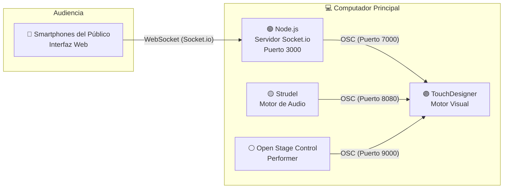

# Unidad 8

## Bitácora de proceso de aprendizaje

### Actividad 01 — Organización de la documentación

**Fecha: 5 de mayo de 2026**

#### 1. Diagrama del sistema

El sistema de la obra *Cosmos* se estructura como un ecosistema interactivo en tiempo real compuesto por cuatro componentes principales: **audio, visuales, performer y público**, conectados mediante protocolos de comunicación que permiten el flujo continuo de datos.



**Descripción del flujo de datos:**

- El **audio generado en Strudel** envía eventos mediante OSC a TouchDesigner, activando cambios visuales en tiempo real.
- El **performer**, a través de Open Stage Control, controla la transición estructural de la obra.
- El **público**, desde sus dispositivos móviles, envía información de color mediante Socket.io hacia un servidor Node.js, que traduce estos datos a OSC para modificar parámetros visuales.

#### 2. Paso a paso para reproducir la obra

**Requisitos previos**

**Hardware:**

- Computador (Mac o Windows)
- Dispositivo móvil (celular)
- Tablet (opcional, para control del performer)

**Software:**

- TouchDesigner
- Node.js
- Navegador web
- Open Stage Control
- Strudel

**Instalación**

1. Clonar el repositorio:

```bash
git clone [Enlace al repositorio]
cd Proyecto_Cosmos
```

2. Instalar dependencias:

```bash
npm install
```

**Ejecución del sistema**

1. Iniciar el servidor:

```bash
node server.js
```

2. Abrir TouchDesigner:

- Cargar el archivo `.toe`
- Verificar recepción OSC en puertos:
  - 8080 (audio)
  - 9000 (performer)
  - 7000 (público)

3. Ejecutar Strudel:

- Iniciar la partitura
- Verificar envío de datos OSC

4. Conectar Open Stage Control:

- Abrir interfaz del performer
- Probar slider y botón reset

5. Conectar público:

- Conectar dispositivos a la misma red
- Acceder a:

```
http://[IP-del-servidor]:3000
```

6. Verificar funcionamiento:

- La luna cambia de color
- Las visuales responden al performer
- Existe sincronización con el audio
- No hay latencia perceptible

#### 3. Explicación detallada

*Cosmos* es una experiencia audiovisual interactiva que simula la formación de un entorno espacial. La obra se desarrolla de manera progresiva, pasando de un estado de calma a uno de alta intensidad, generando sensaciones de expansión, descubrimiento y asombro.

El sistema se organiza en cuatro componentes:

- **Audio (Strudel):** genera la estructura sonora en tiempo real y define la evolución temporal.
- **Visuales (TouchDesigner):** construyen el entorno visual mediante partículas y reaccionan a inputs externos.
- **Performer (Open Stage Control):** controla la transición entre estados visuales.
- **Público (Web + Socket.io):** interviene modificando el color de la luna en tiempo real.

Por otro lado, la obra utiliza una estética espacial basada en nebulosas y cuerpos celestes, una paleta de colores en tonos morado, rosado y naranja, inspirada en imágenes astronómicas. De igual forma, el uso de partículas permite representar procesos de formación y movimiento, ademas de tener a la luna funciona como elemento central y punto de conexión con el público.

El sistema distribuye el control de la experiencia:

- El **audio** define el tiempo
- El **performer** define la estructura
- El **público** introduce variación

Esto convierte la obra en un sistema dinámico donde múltiples agentes influyen en un mismo entorno.
  
## Bitácora de aplicación 


## Bitácora de reflexión
